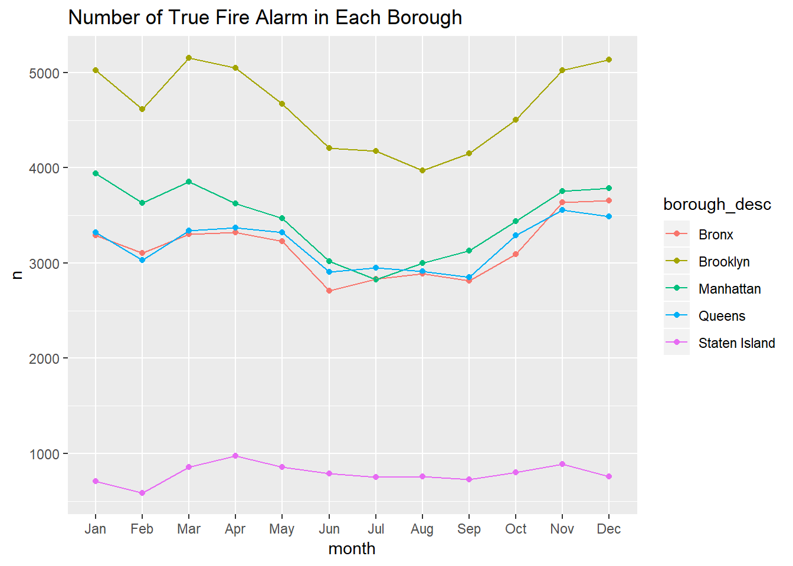
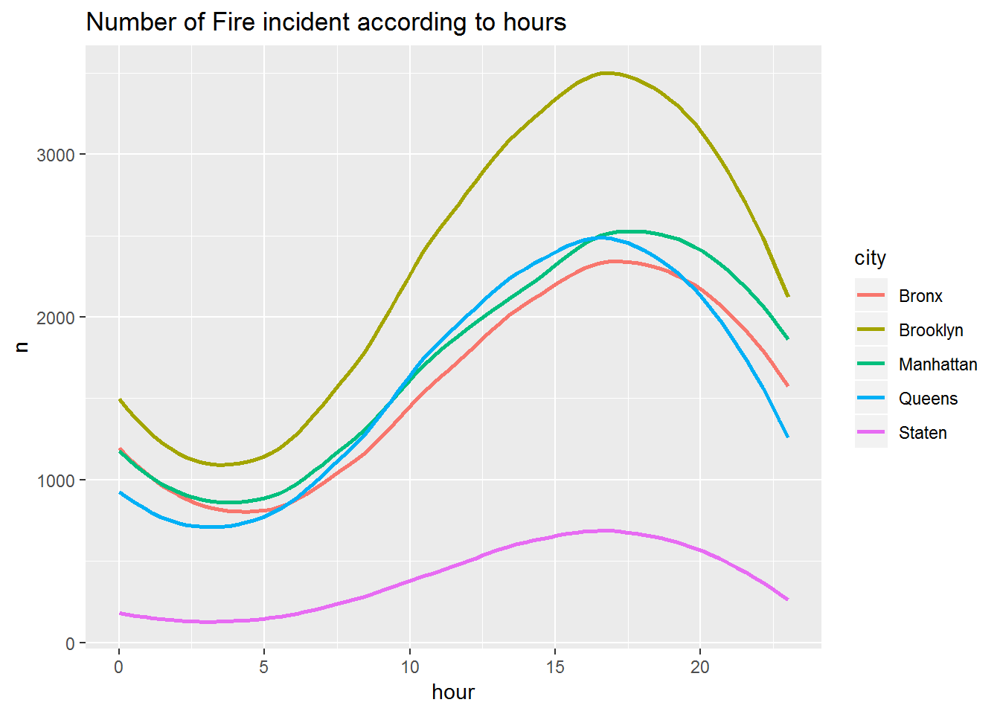

To know the possible effects on the number of fire incidents,  we plot two graphs to devlope potential effects. The first graph is the number of fire incidents in each borough according to months.  We are interested in the effect of seasons, and we expected that the highest number of fire incidents would be in winter due to the dry weather.

We can observe from the plot that the peak of the highest number of fire incidents happen from November to March.  However, we can find that counts in February is relatively low among these months.  (cause by NA value?)

Similarly,  we plot a distribution of the number of fire incidents according to hours for each borough.  The plot indicates that most fire incidents happened in the afternoon.  

From visualization, we detect that the number of the fire incident vary distinctively among different hours and seasons. We will do a further statistical test to see if there is any relationship between season and a total number of fire incidents.

